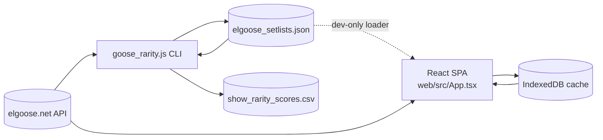

# Architecture

## Purpose
- Deliver rarity analytics for Goose (and related projects) setlists through two complementary surfaces: a Node.js CLI that produces CSV reports and a React single-page application that visualises the same metrics.
- Keep data retrieval efficient by caching API results locally (filesystem for the CLI, IndexedDB for the browser) and synchronising only new shows or setlist entries.
- Support static GitHub Pages hosting without bundling the full dataset while still allowing developer conveniences when running locally.

## Component Overview
- **CLI (`goose_rarity.js`)**: Uses Commander to parse arguments, fetches from `https://elgoose.net/api/v2`, persists `elgoose_setlists.json`, and computes rarity scores that are written to `show_rarity_scores.csv`.
- **Shared algorithms (`goose_rarity.js`, `web/src/lib/rarity.ts`)**: Normalise setlists, compute rarity weighting, and expose helpers such as `createSetlistEntryKey` for deduplication and sorting.
- **Web dashboard (`web/src/App.tsx`)**: React + React Router SPA that loads cached data, triggers incremental API sync via `web/src/lib/api.ts`, and renders dashboards, show detail, song detail, and cover-artist views. Caches data in IndexedDB via `web/src/lib/cache.ts`.
- **Build tooling (`web/vite.config.ts`)**: Vite configuration adds a dev-only middleware for serving the raw dataset and a build-time plugin that inlines JS/CSS into `docs/index.html` for GitHub Pages.
- **Testing & coverage (`tests/e2e/routes.spec.ts`, `tests/fixtures/coverage.ts`, `scripts/convert-playwright-coverage.mjs`)**: Playwright exercises UI flows, captures Chromium coverage chunks, and converts them to Istanbul format for reporting alongside Vitest coverage for the CLI.

## Data Flow

## Key Modules & Collaboration
- **Dataset synchronisation (`syncDatasetFromApi` / `syncDatasetWithApi`)**
  - Compare incoming show IDs against cached data and fetch only missing setlists (five concurrent requests).
  - Deduplicate setlist entries with stable keys to keep local caches immutable.
  - Surface progress callbacks to the UI so users see status messages while new data downloads.
- **Rarity computation (`computeRarityScores`)**
  - Calculates song-specific rarity metrics (frequency, first-play bonus, cover penalties) and aggregates them per show.
  - Applies length attenuation and minimum score floors before returning ranked shows and skipped entries for missing setlists.
  - Shared logic in the CLI and web app ensures consistent results across surfaces.
- **Caching layers**
  - CLI persists JSON to disk (`elgoose_setlists.json`) and optionally consumes `ELGOOSE_DATASET_JSON` to inject datasets in constrained environments.
  - Web dashboard relies on `idb-keyval` to store the latest dataset in the browser; the “Clear Cache” control wipes this key and is disabled when no cache exists.
- **UI composition**
  - Routing via `HashRouter` exposes dashboards (`/#/`), cover index (`/#/covers`), cover details, show detail (`/#/shows/:id`), and song detail (`/#/songs/:key`).
  - Tailwind CSS drives styling; Shadcn-inspired UI primitives in `web/src/components/ui` wrap Radix Slot + Tailwind classes for buttons, inputs, cards, etc.
  - Progress indicators and spinners (Lucide icons) communicate loading while filters (`useTransition`) keep the interface responsive.
- **Build pipeline**
  - `vite.config.ts` writes production assets to `docs/` with `base: './'` to keep relative paths GitHub Pages-friendly.
  - The post-build plugin replaces `<link rel="stylesheet">` and `<script type="module">` tags with inline content and deletes the generated `assets/` directory, producing a self-contained `index.html`.

## Frameworks, Libraries, and Runtimes
- **Node.js ≥ 18** (tested with v23.5.0) for the CLI, test runners, and tooling; native `fetch` is used for API calls.
- **Commander**, **Chalk**, **Papa Parse** for CLI UX, logging, and CSV generation.
- **React 19**, **React Router 7**, **lucide-react**, **idb-keyval**, **Tailwind CSS**, and **Vite 7** for the SPA.
- **Vitest** and **Playwright** for automated testing; Istanbul tooling converts Playwright coverage to standard reports.
- **IndexedDB** (via `idb-keyval`) and filesystem JSON cache underpin local persistence layers.

## Design Choices & Constraints
- **Incremental updates**: Treat the API dataset as append-only, fetching only new shows to minimise bandwidth and respect API rate limits.
- **Immutable caches**: Once written, cached show/setlist entries are reused; deduplication guards against API ID inconsistencies.
- **No bundled production dataset**: The SPA omits `elgoose_setlists.json` from the build to keep the GitHub Pages bundle small; a dev-only middleware re-exposes it for local testing.
- **Static hosting**: All assets are inlined into `docs/index.html`, enabling drop-in deployment on GitHub Pages without additional servers.
- **Environment override**: `ELGOOSE_DATASET_JSON` lets the CLI operate in sandboxed or CI environments where filesystem writes are restricted.
- **External dependency risk**: Both surfaces rely on the public `elgoose.net` API; outages or schema changes propagate directly and should be monitored.
